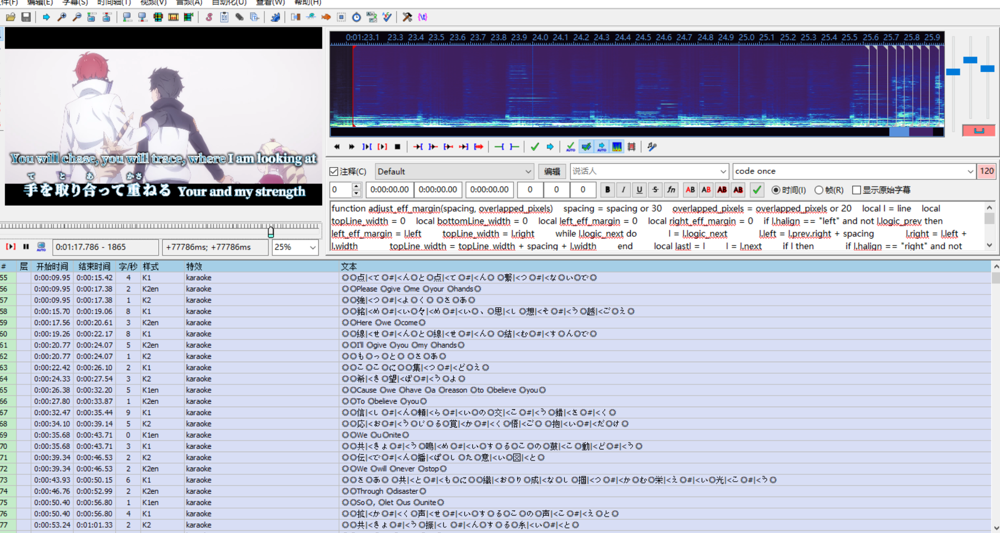

    

  

# Aegisub_Karaoke
> 本仓库旨在存放我个人使用Aegisub制作Karaoke时编写的相关文件
## 📂 项目结构    
- [kara-templater-v1.lua](kara-templater-v1.lua)  
    kara-templater-v1.lua更改了Aegisub自带的逐行处理karaskel.preproc_line()与apply_line()逻辑为分块处理  
    增添了四个新的aegisub变量  
    `line.prev`  - 当前行的物理结构的上一行(仅真正含有歌词字幕的dialogue行)，如果没有则为`nil`  
    `line.next`  - 当前行的物理结构的上一行(仅真正含有歌词字幕的dialogue行)，如果没有则为`nil`  
    `line.logic_prev` - 若当前的`line.prev`开始时间与结束时间与当前line相同，那么这个变量指`line.prev`，否则为`nil`  
    `line.logic_next` - 若当前的`line.next`开始时间与结束时间与当前line相同，那么这个变量指`line.next`，否则为`nil`   
- [adjust_eff_margin.lua](adjust_eff_margin.lua)  
    智能(智障)调节卡拉OK上下两行的左右间距，示例如下:
    
     
        
    
  

    首先**同开始时间和同结束时间的行将被视为一行**，如上图所示，可以在“一行”中使用多个样式，只要它们开始时间和结束时间相同 
    **这些被视为一行的行如果它们的第一个开始行是左对齐(\an1)的，那么称之为总上行，如果是右对齐(\an3)的，那么称之为总下行，因此只支持\an1与\an3对齐方式**   
    **总上行和总下行必须是交替出现的，但可以单独存在一个总上行，但不能单独存在一个总下行**  
    函数有两个参数，其一为同一行之间不同样式行之间的间距，其二为最终整个上行与整个下行在x轴上重叠的像素数，在code once行定义函数，接着在code line all行使用它，函数将完成以下的事情:  
    &nbsp;&nbsp;&nbsp;&nbsp;1.将视为同一行的行使用参数一进行处理计算，并归纳为一个总行，每次循环获取一个总上行和一个总下行  
    &nbsp;&nbsp;&nbsp;&nbsp;2.计算总上行和总下行的总宽度，*[逻辑一]* 如果小于(屏幕宽 - 参数二)，那么就对总上行和总下行进行向内居中的操作，距离取决于参数二，*[逻辑二]* 否则如果有任意一个总行超出屏幕宽则输出提示，如果接近屏幕宽则自动调整并提示，如果都不满足以上情况那么说明无需调整  
    &nbsp;&nbsp;&nbsp;&nbsp;3.对于只有一个单总上行的情况则不执行 *[逻辑一]* ，而是执行 *[逻辑二]* ，接着会对这个单总行进行居中，此居中为绝对居中